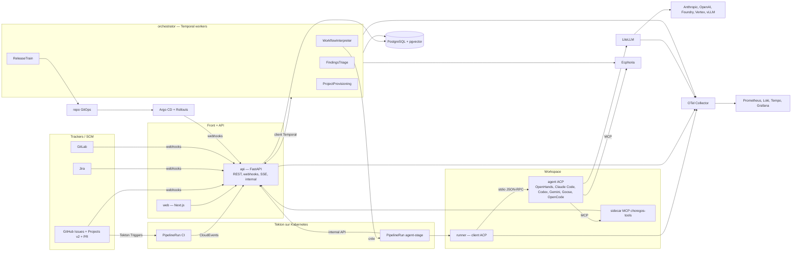

# 1. Architecture et contrats

Les contrats de cette section sont **gelés à la fin de la semaine 1** (jalon M0). Ils vivent dans `packages/contracts/` : JSON Schemas (`schemas/*.json`), OpenAPI (`openapi.yaml`), types générés (`python/choregos_contracts/`, `ts/`). Toute modification passe par une PR taguée `contract-change`, relue par le flux intégrateur, et déclenche la régénération des types.

## 1.1 Vue d'ensemble



Principes : le tracker est l'interface humaine ; l'orchestrateur planifie et n'appelle jamais un modèle ; le runner est jetable, la mémoire et les résultats sont durables ; toute garantie est un mécanisme (gate, sandbox, vérification de diff), jamais une phrase de prompt ; la prod est un verrou.

## 1.2 Monorepo `VargaFoundation/choregos`

```
choregos/
├── AGENTS.md  CLAUDE.md -> AGENTS.md  README.md  LICENSE  Makefile  justfile
├── docs/plan/                      # ce plan
├── packages/
│   ├── contracts/                  # SOURCE DE VÉRITÉ des interfaces (schemas, openapi, types générés)
│   ├── core/                       # Python : modèles de domaine, DSL (parse/validate), policy engine, résolution de modèles
│   ├── adapters/                   # Python : tracker/, scm/, ci/, cd/, executor/, memory/, gateway/, notify/ (+ fakes pour tests)
│   ├── runner/                     # Python : client ACP, backends (launch specs), guardrails, validation résultat → image `choregos-runner`
│   ├── tools-mcp/                  # Python : serveur MCP sidecar `choregos-tools` (report_finding, ask_human…)
│   ├── playbooks/                  # prompts par rôle, variables, évals
│   └── cli/                        # `choregos` CLI (typer) : projets, runs, trains, dev
├── apps/
│   ├── api/                        # FastAPI : REST, webhooks, SSE, internal, auth OIDC
│   ├── orchestrator/               # workers Temporal : workflows + activités
│   └── web/                        # Next.js : front
├── templates/
│   └── github-tekton-argo-k8s/     # manifest.yaml, tekton/, argo/, k8s/, scaffold/
├── charts/
│   └── choregos/                   # Helm umbrella (api, web, orchestrator, tools, migrations, runner config)
├── tests/
│   ├── e2e/                        # scénarios bout en bout sur kind
│   └── conformance/                # suite de conformité backends ACP + templates
├── dev/                            # kind config, Tiltfile, docker-compose (Postgres, Temporal dev, LiteLLM, Ecphoria)
└── .github/workflows/              # CI du monorepo (lint, tests, images, charts, e2e nightly)
```

Dépôt séparé `VargaFoundation/choregos-infra` : bootstrap Argo CD app-of-apps, valeurs par environnement, manifests des projets provisionnés (section 6).

## 1.3 Modèle de données (PostgreSQL)

Conventions : UUID v7 en clé primaire, `created_at`/`updated_at` partout, `jsonb` pour les documents validés par schéma, migrations Alembic dans `apps/api/migrations/`. Toutes les tables porteuses de données projet ont `project_id` et sont couvertes par RLS (`SET app.current_org`).

| Table | Colonnes clés | Notes |
| :-- | :-- | :-- |
| `organizations` | id, slug, name, settings jsonb | |
| `users` | id, oidc_sub, email, display_name, last_login_at | |
| `memberships` | user_id, org_id, project_id nullable, role enum(org_admin, project_owner, developer, release_captain, viewer) | project_id null = rôle org |
| `projects` | id, org_id, slug, name, template_ref, config jsonb (schéma `Project`), status enum(draft, provisioning, active, suspended, archived) | |
| `connectors` | id, project_id, kind enum(tracker, scm, ci, cd, runtime, memory, notify, gateway), type, config jsonb, secret_ref, status, last_check_at, last_error | secrets jamais en clair |
| `workflow_defs` | id, project_id, name, version int, source enum(repo, platform, template), yaml text, json jsonb, checksum, is_active | épinglé par work_item |
| `policies` | id, project_id, version, yaml, json, is_active | |
| `model_profiles` | id, scope enum(platform, project), project_id nullable, name, litellm_model, params jsonb, validated_backends text[] | |
| `templates` | id, name, version, manifest jsonb, repo_url, is_published | |
| `work_items` | id, project_id, tracker_key, title, body_snapshot, size enum(S,M,L,XL), risk enum(low,medium,high), state, workflow_def_id, policy_id, temporal_wf_id, created_by, closed_at, totals jsonb (tokens_in, tokens_out, tokens_cached, cost_usd, cost_eur, duration_s) | `state` = nom d'état du DSL |
| `runs` | id, work_item_id, project_id, transition_id, stage_role, attempt, actor, backend, model, executor_kind, executor_ref, status enum(queued, running, succeeded, failed, cancelled, timed_out), started_at, ended_at, tokens jsonb, cost_usd, gateway_key_id, result jsonb (`StageResult`), transcript_url, context_pack_url, playbook_checksum | |
| `run_events` | id, run_id, seq, type, payload jsonb, ts | journal ACP (append-only, partitionné par mois) |
| `human_requests` | id, work_item_id, transition_id, kind enum(approval, question, scope_change), payload, requested_at, due_at, decided_by, decided_at, decision jsonb | |
| `events` | id, project_id, work_item_id nullable, type, payload jsonb, ts | bus interne (append-only) |
| `findings` | id, project_id, origin_work_item_id, origin_run_id, title, type, severity, evidence, suggested_fix, estimate, status enum(pending, created, duplicate, dismissed), created_work_item_id, duplicate_of, embedding vector(1536) | index HNSW |
| `releases` | id, project_id, env, batch_no, status enum(collecting, departing, staging, awaiting_approval, promoting, verifying, done, rolled_back, frozen), items jsonb, started_at, ended_at, approved_by, verdict jsonb, notes text | |
| `deployments` | id, release_id, env, revision, cd_ref, status, started_at, ended_at, analysis jsonb | |
| `cost_ledger` | id, project_id, work_item_id, run_id, provider, model, tokens_in, tokens_out, tokens_cached, cost_usd, cost_eur, fx_rate, ts | source des agrégats |
| `audit_log` | id, actor_id, actor_kind enum(user, agent, system), action, target_type, target_id, payload, ts | |
| `api_tokens` | id, user_id, name, hash, scopes, expires_at | CLI |

Vues matérialisées rafraîchies par cron : `v_project_costs_daily`, `v_workitem_cycle_time`, `v_first_pass_merge_rate`, `v_dora`.

## 1.4 Le DSL de workflow — schéma

Fichier `schemas/workflow.schema.json` (résumé normatif) :

```yaml
apiVersion: const "choregos/v1"
kind: const "Workflow"
metadata: { name: slug, version: int, description?: string, extends?: "template:<name>@<ver>" }
actors: map<actorId, Actor>
  Actor (agent): { type: "agent", role: enum[triage, refine, plan, implement, verify, review, fix_ci, address_review, release_notes, verify_prod, custom],
                   model: "profile:<name>" | "profile:by_size" | "<litellm_model>", backend?: string, fresh_context?: bool,
                   max_turns?: int, max_minutes?: int, playbook?: string }
  Actor (human): { type: "human", group: string, sla_hours?: int, escalate_to?: string }
  Actor (system): { type: "system" }
states: map<stateId, State>
  State: { display: string, tracker?: { status?: string, label?: string }, terminal?: bool, kind?: enum[work, wait, terminal] }
transitions: list<Transition>
  Transition: { id?: string, from: stateId | "*agent", to: stateId,
                by?: actorId,            # exclusif avec via
                via?: "release_train",   # → train: { env, approval?: actorId, auto_sync?: bool }
                gates?: list<GateRef>, outputs?: list<string>, inputs?: list<string>,
                on_fail?: Retry, on_reject?: stateId, on_changes_requested?: Retry,
                review?: { agents?: list<actorId>, humans?: { group, required: "always"|"by_policy"|"never" } },
                timeout_hours?: int }
  Retry: { to: stateId, max_attempts: int, escalate_to: stateId }
  GateRef: string | { name: string, params: map }
defaults: { from_any_agent_state?: { on_question: stateId, on_budget_exceeded: stateId, on_timeout: stateId },
            needs_human?: { on_answer: "resume", on_abandon: stateId } }
```

Règles de validation statique (erreurs bloquantes) : exactement un état initial (le premier déclaré) ; au moins un état terminal atteignable ; pas d'état orphelin ; toute transition de retour porte `max_attempts` ; tout état `deployed_prod*` n'est atteignable que `via: release_train` ; les acteurs référencés existent ; les gates existent dans le registre ; `profile:` référencé résolu au moment de l'épinglage. Avertissements : pas d'état `needs_human`, pas de `verify` avant `pr_open`.

Gates du registre (`packages/core/gates/`) : `ci_green`, `scans_ok`, `evidence_present`, `scope_respected`, `review_approved`, `coverage_delta_min(x)`, `diff_size_max(n)`, `no_secrets`, `provenance_signed`, `external(url)`.

Templates livrés : `full-auto`, `default-simple`, `advanced` (définitions complètes dans `packages/core/dsl/templates/`).

## 1.5 `StageInput` (orchestrateur → runner)

```json
{
  "run_id": "01J…", "attempt": 1,
  "project": { "slug": "billing-api", "org": "acme" },
  "work_item": { "key": "acme/billing-api#123", "title": "…", "body": "…", "url": "…", "size": "M", "risk": "low",
                 "links": { "spec_comment": "…", "plan_comment": "…", "pr": null } },
  "transition": { "id": "t-implement", "role": "implement", "from": "ready", "to": "in_progress",
                  "outputs": ["branch", "commits"], "inputs": ["spec", "allowed_paths"] },
  "repo": { "url": "https://github.com/acme/billing-api.git", "base_branch": "main", "work_branch": "choregos/123-slug",
            "clone_depth": 50 },
  "agent": { "backend": "openhands", "launch": { "command": ["openhands", "acp"], "env": {}, "files": {} } },
  "model": { "litellm_model": "anthropic/claude-sonnet-5", "base_url": "http://litellm.choregos-gateway:4000",
             "api_format": "openai", "params": { "temperature": 0 } },
  "gateway_key": "sk-…",                       # clé virtuelle du run, budget = budget de l'étape
  "budget": { "usd": 12.0, "max_turns": 80, "max_minutes": 60 },
  "allowed_paths": ["src/orders/**", "tests/orders/**"],
  "context_pack_url": "s3://…/runs/01J…/context.json",
  "playbook": { "ref": "implement@sha256:…", "prompt_url": "s3://…" },
  "tools": { "mcp": { "choregos": { "url": "http://localhost:7777/mcp" }, "memory": { "url": "http://ecphoria.choregos-memory:8432/mcp" } } },
  "permissions": { "write_paths": ["src/orders/**", "tests/orders/**"], "deny_commands": ["kubectl", "terraform apply", "git push --force"] },
  "callbacks": { "api_url": "https://api.choregos.acme.dev/internal", "run_token": "eyJ…" }
}
```

## 1.6 `StageResult` (runner → orchestrateur)

```json
{
  "schema": "choregos/StageResult/v1",
  "status": "done | blocked | needs_human | failed",
  "summary": "…",
  "outputs": { "size": "M", "risk": "low", "allowed_paths": ["…"], "spec_markdown": "…", "plan_markdown": "…" },
  "artifacts": { "branch": "…", "commits": ["…"], "pr_url": "…", "transcript_url": "…", "reports": { "tests": "…", "coverage": "…" } },
  "evidence": { "tests_passed": true, "tests_run": 412, "tests_failed": 0, "coverage_delta": 1.2, "lint": "ok", "typecheck": "ok", "security_scan": "ok" },
  "questions": [ { "text": "…", "options": ["…"] } ],
  "findings": [ { "title": "…", "type": "perf|bug|security|tech-debt|docs|flaky-test", "severity": "low|medium|high|critical",
                  "evidence": "path:line", "suggested_fix": "…", "estimate": "S|M|L" } ],
  "scope_changes_requested": [ { "paths": ["…"], "justification": "…" } ],
  "diagnostics": { "turns": 43, "tool_calls": 118, "permission_denials": 2, "duration_s": 1260, "agent_exit": "normal" }
}
```

Le coût n'est **pas** dans `StageResult` : l'orchestrateur le lit au gateway (section 4). L'agent écrit `.choregos/result.json` ; le runner le valide, le complète (`artifacts`, `evidence`, `diagnostics`) et le poste.

## 1.7 Événements

Format CloudEvents 1.0 (`type`, `source`, `subject`, `time`, `data`). Persistés dans `events`, publiés en SSE au front, exportés en OTel logs.

| Type | Émetteur | Données |
| :-- | :-- | :-- |
| `choregos.workitem.created` / `.state_changed` / `.closed` | orchestrateur | key, from, to, by |
| `choregos.workitem.human_requested` / `.human_decided` | orchestrateur / API | kind, payload, decision |
| `choregos.run.queued` / `.started` / `.progress` / `.finished` | orchestrateur / runner | run_id, stage, status, tokens, cost |
| `choregos.finding.reported` / `.created` / `.duplicate` / `.dismissed` | runner / triage | finding |
| `choregos.release.collected` / `.departed` / `.staged` / `.approval_requested` / `.promoted` / `.verified` / `.rolled_back` / `.frozen` | train | release |
| `choregos.cost.recorded` | orchestrateur | ledger entry |
| `choregos.project.provisioning.step` / `.completed` / `.failed` | provisioning | step, status |

Entrants normalisés par les adaptateurs (`InboundEvent`) : `tracker.item.created|updated|moved|commented|labeled`, `scm.pr.opened|synchronized|review_submitted|merged|closed`, `scm.check.completed`, `ci.run.started|succeeded|failed`, `cd.app.synced|degraded|rollout.completed|rollout.aborted`, `alert.fired|resolved`.

## 1.8 API (OpenAPI — résumé)

Base `/api/v1`. Auth : session OIDC (cookie) ou `Authorization: Bearer <api_token>`. Pagination par curseur. Erreurs RFC 9457.

| Ressource | Endpoints |
| :-- | :-- |
| Session | `GET /me`, `GET /auth/login`, `GET /auth/callback`, `POST /auth/logout` |
| Projets | `GET/POST /orgs/{org}/projects`, `GET/PATCH/DELETE /projects/{id}`, `POST /projects/{id}/provision`, `GET /projects/{id}/provision`, `POST /projects/{id}/suspend` |
| Connecteurs | `GET /projects/{id}/connectors`, `PUT /projects/{id}/connectors/{kind}`, `POST /projects/{id}/connectors/{kind}/test`, `GET /connectors/types` |
| Workflow / politique | `GET/PUT /projects/{id}/workflow`, `POST /workflows/validate`, `GET /workflows/templates`, `GET/PUT /projects/{id}/policy` |
| Modèles | `GET /platform/models`, `GET/PUT /projects/{id}/models`, `GET /projects/{id}/models/matrix` (évals backend × modèle) |
| Work items | `GET /projects/{id}/work-items`, `GET /work-items/{id}`, `GET /work-items/{id}/timeline`, `POST /work-items/{id}/decisions` (approve, reject, answer, scope_change), `POST /work-items/{id}/actions` (pause, resume, stop, migrate, rerun_stage, mark_agent_ready) |
| Runs | `GET /work-items/{id}/runs`, `GET /runs/{id}`, `GET /runs/{id}/events` (SSE), `GET /runs/{id}/transcript`, `GET /runs/{id}/diff` |
| Trains | `GET /projects/{id}/releases`, `GET /releases/{id}`, `POST /projects/{id}/trains/{env}/depart`, `POST /projects/{id}/trains/{env}/freeze`, `POST /projects/{id}/trains/{env}/unfreeze`, `POST /releases/{id}/approve`, `POST /releases/{id}/abort` |
| Findings | `GET /projects/{id}/findings`, `POST /findings/{id}/actions` (create_ticket, mark_duplicate, dismiss, agent_ready) |
| Mémoire | `GET /projects/{id}/memory/search?q=`, `GET/POST /projects/{id}/memory/pending`, `POST /projects/{id}/memory/reimport` |
| Coûts | `GET /projects/{id}/costs?group_by=day|stage|model|backend|size`, `GET /orgs/{org}/costs` |
| Templates | `GET /templates`, `GET /templates/{name}` ; admin `POST/PUT` |
| Admin | `GET/PUT /platform/backends`, `GET/PUT /platform/executors`, `GET /platform/gateway/keys`, `GET/POST /orgs/{org}/members`, `GET /audit` |
| Webhooks (entrants) | `POST /webhooks/github` (HMAC), `POST /webhooks/jira`, `POST /webhooks/gitlab`, `POST /webhooks/tekton` (CloudEvents), `POST /webhooks/argocd`, `POST /webhooks/alertmanager` |
| Internal (runner → API, JWT de run) | `GET /internal/runs/{id}/input`, `POST /internal/runs/{id}/events` (batch), `POST /internal/runs/{id}/result`, `POST /internal/runs/{id}/findings`, `POST /internal/runs/{id}/scope-change`, `POST /internal/runs/{id}/question`, `GET /internal/runs/{id}/context`, `GET /internal/runs/{id}/ticket`, `GET /internal/runs/{id}/ci-logs` |

Le front consomme uniquement cette API ; le CLI aussi. L'orchestrateur ne passe pas par l'API pour la base (accès direct via `packages/core`), mais les webhooks entrants passent par l'API qui signale Temporal.

## 1.9 Interfaces d'adaptateurs (Python `Protocol`, `packages/adapters/base.py`)

```python
class TrackerAdapter(Protocol):
    async def fetch_item(self, key: str) -> WorkItemData: ...
    async def create_item(self, data: NewItem) -> str: ...
    async def set_state(self, key: str, state_mapping: TrackerStateMapping) -> None: ...   # status et/ou label
    async def upsert_status_comment(self, key: str, markdown: str, marker: str) -> None: ...
    async def comment(self, key: str, markdown: str) -> str: ...
    async def link(self, a: str, b: str, relation: Literal["origin", "duplicate", "blocks"]) -> None: ...
    async def set_fields(self, key: str, fields: dict[str, Any]) -> None: ...             # cost, size, risk, run_url
    async def list_candidates(self, project: ProjectConfig) -> list[str]: ...             # polling de secours
    def parse_webhook(self, headers: Mapping[str, str], body: bytes) -> list[InboundEvent]: ...
    def verify_webhook(self, headers, body) -> bool: ...

class ScmAdapter(Protocol):
    async def mint_token(self, repo: str, ttl_s: int, scopes: list[str]) -> str: ...
    async def ensure_branch(self, repo: str, name: str, base: str) -> None: ...
    async def open_pr(self, repo: str, head: str, base: str, title: str, body: str, draft: bool) -> PrRef: ...
    async def update_pr(self, ref: PrRef, body: str | None, draft: bool | None) -> None: ...
    async def get_pr(self, ref: PrRef) -> PrState: ...                                    # checks, reviews, mergeable, diff files
    async def request_review(self, ref: PrRef, reviewers: list[str]) -> None: ...
    async def enqueue_merge(self, ref: PrRef) -> None: ...
    async def compare(self, repo: str, base: str, head: str) -> DiffSummary: ...
    def parse_webhook(self, headers, body) -> list[InboundEvent]: ...

class CiAdapter(Protocol):
    async def status_for(self, repo: str, sha: str) -> CiStatus: ...
    async def logs(self, run_ref: str, tail: int = 500) -> str: ...
    async def trigger(self, repo: str, ref: str, pipeline: str) -> str: ...
    def parse_event(self, headers, body) -> list[InboundEvent]: ...

class CdAdapter(Protocol):
    async def current_revision(self, app: str) -> str: ...
    async def promote(self, env: str, changes: list[Change], release: str) -> PromotionRef: ...   # PR GitOps
    async def health(self, app: str) -> Health: ...
    async def rollout_status(self, app: str) -> RolloutState: ...
    async def abort_rollout(self, app: str) -> None: ...
    async def set_sync_window(self, app: str, windows: list[Window]) -> None: ...

class Executor(Protocol):
    async def start(self, spec: StageJobSpec) -> ExecRef: ...
    async def status(self, ref: ExecRef) -> ExecStatus: ...
    async def logs(self, ref: ExecRef) -> AsyncIterator[str]: ...
    async def cancel(self, ref: ExecRef) -> None: ...

class AgentBackend(Protocol):
    name: str
    capabilities: frozenset[str]        # {"acp", "mcp", "agents_md", "structured_output"}
    def launch_spec(self, ctx: LaunchContext) -> LaunchSpec: ...   # command, env, files à écrire, config MCP
    def model_env(self, model: ModelRef) -> dict[str, str]: ...    # LLM_MODEL/LLM_BASE_URL ou ANTHROPIC_*

class MemoryAdapter(Protocol):
    async def context_pack(self, project: str, query: str, paths: list[str], budget_tokens: int) -> ContextPack: ...
    async def write_fact(self, project: str, fact: Fact) -> str: ...
    async def propose_fact(self, project: str, fact: Fact, provenance: Provenance) -> str: ...
    async def ingest_events(self, project: str, events: list[dict]) -> None: ...
    async def search(self, project: str, query: str, k: int) -> list[Memory]: ...

class GatewayAdapter(Protocol):
    async def mint_key(self, metadata: dict, budget_usd: float, ttl_s: int, models: list[str]) -> VirtualKey: ...
    async def spend(self, key_id: str) -> Spend: ...                  # tokens in/out/cached, cost_usd, requests
    async def revoke(self, key_id: str) -> None: ...
    async def list_models(self) -> list[GatewayModel]: ...

class Notifier(Protocol):
    async def send(self, channel: str, message: Message) -> None: ...
```

Chaque adaptateur a une implémentation `Fake*` en mémoire (`packages/adapters/fakes/`) utilisée par les tests de l'orchestrateur et du front (via l'API en mode `CHOREGOS_FAKES=1`) : c'est ce qui permet aux flux de travailler en parallèle sans attendre les connecteurs réels.

## 1.10 Sécurité des contrats

- Webhooks : HMAC (GitHub), secret partagé (Jira/GitLab), CloudEvents signés ou réseau interne (Tekton/Argo). Rejeu protégé par `delivery_id` unique.
- `run_token` : JWT signé par l'API (ES256), `aud=internal`, `sub=run_id`, TTL = `max_minutes + 15`, portée limitée au run ; le runner ne détient rien d'autre.
- Toute écriture d'un agent sur le tracker passe par l'API interne (jamais un token GitHub large dans le workspace).
