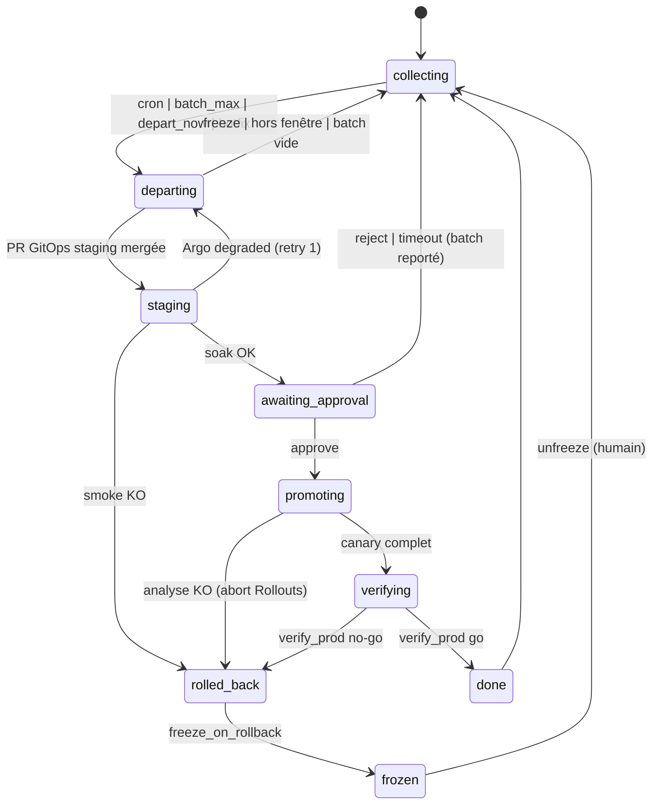
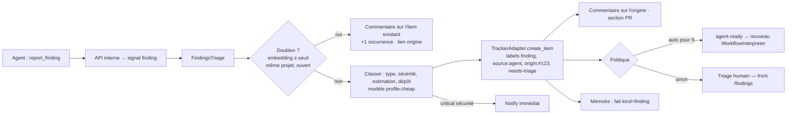

# 5. Release train et findings

## 5.1 Release train — pourquoi trois verrous

| Verrou | Ce qu'il garantit | Où |
| :-- | :-- | :-- |
| Merge queue | `main` toujours intégré et vert, une PR à la fois | GitHub / GitLab |
| `ReleaseTrain` (Temporal, singleton par projet × env) | Un seul déploiement en cours par environnement, batches, cadence, fenêtres, soak, approbation, canary, rollback, freeze | Choregos |
| Garde-fous déclaratifs | Même si Choregos tombe, personne ne déploie hors règles : *sync windows* Argo CD, `GitHub Environment production` (approbateurs requis, wait timer), lock Atlantis pour Terraform | Cluster / SCM |

## 5.2 `ReleaseTrain` — spécification

```yaml
# extrait de .choregos/policy.yaml
release_train:
  dev:     { mode: auto_sync }                                  # pas de train : Argo suit main
  staging: { schedule: "*/30 9-19 * * 1-5", batch_max: 10, soak_minutes: 10, approval: none }
  prod:
    schedule: "0 10,14,17 * * 1-4"                              # Europe/Paris
    windows: ["Mon-Thu 09:00-18:00"]
    batch_min: 1
    batch_max: 8
    soak_minutes: 20
    approval: { group: release-captains, required: true, timeout_hours: 4 }
    canary: { steps: [10, 50, 100], analysis: slo-default, step_minutes: [10, 15, 0] }
    express_lane: { label: hotfix, soak_minutes: 5, skip_schedule: true, approval: { group: release-captains } }
    freeze: false
    auto_rollback: true
    freeze_on_rollback: true
    terraform: { via: atlantis, apply_requires_approval: true }
```



Signaux : `merged(work_item, sha, risk, labels)`, `depart_now(by)`, `freeze(reason, by)`, `unfreeze(by)`, `approve(release_id, by)`, `reject(release_id, by, reason)`, `abort(by)`, `deploy_event(InboundEvent)`. Requête : `status()` (batch, prochain départ, verrou, freeze).

Activités : `check_window`, `create_release`, `promote(env, changes)` (`CdAdapter.promote` → PR GitOps, merge auto ou par approbateur selon env), `wait_synced`, `run_smoke` (Job Tekton `smoke-<env>`), `soak(minutes, slo_query)` (Prometheus/Azure Monitor), `request_approval` (Slack + GitHub Environment + front), `promote_canary_step`, `analysis_status`, `abort_rollout`, `write_release_notes` (stage `release_notes`), `notify`, `mark_items(deployed|rolled_back)`, `record_incident` (finding `critical` + mémoire).

Terraform : les changements d'infra d'un projet sont des PR ordinaires sur son dépôt `infra/` ; Atlantis poste `plan` ; l'`apply` est déclenché par le train **pendant un départ**, après approbation, sous le lock Atlantis. Choregos ne détient aucun credential cloud : Atlantis les a.

Feature flags : `refine` impose un flag (OpenFeature + Unleash) pour `risk: high` ; la gate `flag_present` vérifie qu'un flag nommé dans la spec existe dans le code ; l'activation reste une décision produit hors train.

## 5.3 GitOps — layout du repo d'environnements

```
<project>-gitops/
├── apps/<app>/base/                 (kustomize : Deployment→Rollout, Service, HPA, PDB)
├── apps/<app>/overlays/{dev,staging,prod}/  (images, replicas, AnalysisTemplate refs)
├── releases/<env>/manifest.yaml     (écrit par le train : release id, items, SHAs, images)
└── argocd/                          (Applications, sync windows, notifications)
```

Le train modifie uniquement `apps/*/overlays/<env>/kustomization.yaml` (tags d'images) et `releases/<env>/manifest.yaml`, dans une PR titrée `release(<env>): R-2026.09.18-2` dont le corps est le journal du batch (tickets, PR, risques, notes). `AnalysisTemplate slo-default` : taux 5xx < 1 %, p95 latence < seuil, erreurs métier < seuil, sur les requêtes Prometheus du projet (paramétrables).

## 5.4 Findings — pipeline



Règles : plafond par run ; seuil de dédup `policy.findings.dedupe_threshold` (défaut 0,86, embeddings `platform/embed`) ; un finding de sévérité `critical` **dans le périmètre** est corrigé dans la PR courante et signalé ; hors périmètre, jamais corrigé — permission ACP refusée + vérification de diff + gate `scope_respected`. Template de ticket : origine (ticket, PR, run, transcript), type, sévérité, estimation, preuve `fichier:ligne`, impact, correction suggérée, pourquoi hors périmètre. Le finding créé est un `WorkItem` ordinaire ; son coût est comptabilisé sur lui, pas sur l'origine.

Boucle de qualité : le front affiche par projet le ratio findings créés / findings fermés « pertinent » ; un taux de faux positifs > 30 % sur 30 jours déclenche une révision du prompt `implement` (invariant « ne signale que ce qui est actionnable »).
