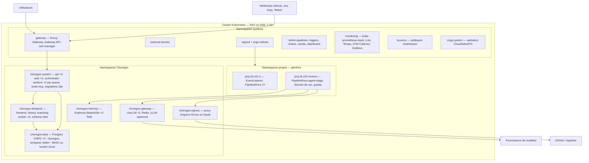

# 6. Déploiement de la plateforme sur Kubernetes

Choregos se déploie **sur** Kubernetes et déploie **vers** Kubernetes ; les deux plans sont séparés : la plateforme vit dans ses namespaces `choregos-*`, chaque projet client dans `proj-<slug>-*`. Tout est GitOps : le dépôt `VargaFoundation/choregos-infra` est la seule source de vérité du cluster ; personne (ni humain, ni API) n'applique de manifeste à la main.

## 6.1 Topologie



Pools de nœuds :

| Pool | Taille | Rôle | Notes |
| :-- | :-- | :-- | :-- |
| `system` | 3 × 4 vCPU / 16 Go | Composants système, API, Temporal, Postgres | Taints `role=system` ; stockage SSD |
| `platform` | 2–3 × 8 vCPU / 32 Go | LiteLLM, Ecphoria, Tekton controllers, monitoring | |
| `runners` | 0–20 × 8 vCPU / 32 Go **spot/preemptible** | PipelineRuns agent et CI | Autoscaler cluster ; `RuntimeClass gvisor` installé ; taint `role=runners` ; éviction tolérée (le run rejoue) |
| `gpu` (optionnel) | 0–2 | vLLM local | Seulement si modèle local |

## 6.2 Composants et charts

Umbrella `charts/choregos/Chart.yaml` :

```yaml
apiVersion: v2
name: choregos
version: 1.0.0
dependencies:
  - { name: choregos-api,          version: 1.x, repository: file://charts/api }
  - { name: choregos-web,          version: 1.x, repository: file://charts/web }
  - { name: choregos-orchestrator, version: 1.x, repository: file://charts/orchestrator }
  - { name: choregos-tools,        version: 1.x, repository: file://charts/tools }
  - { name: temporal,              version: ~0.6x, repository: https://go.temporal.io/helm-charts, condition: temporal.enabled }
  - { name: litellm,               version: pinned, repository: oci://ghcr.io/berriai/litellm-helm, condition: gateway.enabled }
  - { name: ecphoria,              version: 1.x, repository: oci://ghcr.io/vargafoundation/charts, condition: memory.enabled }
  - { name: redis,                 version: pinned, repository: oci://registry-1.docker.io/bitnamicharts }
```

Les opérateurs et l'outillage cluster (CNPG, cert-manager, ESO, Envoy Gateway, Argo CD, Rollouts, Tekton via `tektoncd/operator`, kube-prometheus-stack, Loki, Tempo, OTel Collector, Kyverno, gVisor `containerd-shim` via DaemonSet) sont installés par `choregos-infra/bootstrap/` (app-of-apps), pas par l'umbrella.

Sous-charts Choregos — points notables :

| Chart | Contenu |
| :-- | :-- |
| `api` | Deployment ×2, HPA (CPU 70 %), PDB, `Service`, `HTTPRoute`, `ServiceAccount` (droits : lire `PipelineRun` status dans `proj-*`, rien d'autre), `ConfigMap` (OIDC, URLs), `ExternalSecret` (DB, JWT keys, webhook secrets, GitHub App key), `Job` pre-install/pre-upgrade `alembic upgrade head` (hook Helm `pre-upgrade`, `wait`) |
| `web` | Deployment ×2, `HTTPRoute`, CSP stricte, `NEXT_PUBLIC_*` |
| `orchestrator` | Un Deployment par task queue (`orchestrator`, `executor`, `tracker`, `memory`), réplicas 2, `ServiceAccount executor` avec RBAC : créer/lister/supprimer `PipelineRun`, `Secret`, `ConfigMap` dans les namespaces `proj-*-runners` uniquement (Role par namespace généré par le provisioning) ; KEDA optionnel (scale sur `temporal_task_queue_backlog`) |
| `tools` | Publie l'image `choregos-tools` et la `Task` Tekton `choregos-agent-stage` en `ClusterTask`-like (Task dans chaque namespace projet via Kustomize) |
| `temporal` | Persistence Postgres (CNPG `temporal`), `numHistoryShards: 512`, frontend/history/matching/worker ×2, UI derrière OIDC, `schema` Jobs |
| `litellm` | Postgres `litellm`, Redis, `proxy_config` depuis `ConfigMap` + modèles en base, `PodDisruptionBudget`, `NetworkPolicy` (entrée : runners, orchestrator, api ; sortie : fournisseurs via egress) |
| `ecphoria` | StatefulSet ×3, PVC SSD 50 Go, Raft, `CronJob` backup vers bucket, `ServiceMonitor` |

## 6.3 `choregos-infra` — GitOps de la plateforme

```
choregos-infra/
├── bootstrap/                      # app-of-apps Argo CD : opérateurs et outillage (sync-wave 0–2)
│   ├── cert-manager/ external-secrets/ envoy-gateway/ cnpg/ tekton-operator/ argo-rollouts/ kyverno/ monitoring/ gvisor/
├── platform/                       # l'umbrella choregos par environnement (sync-wave 3)
│   ├── base/ (Application → charts/choregos)  overlays/{dev,staging,prod}/values.yaml
├── projects/                       # écrit par ProjectProvisioning ; ApplicationSet "git directory generator" (sync-wave 4)
│   └── <slug>/  namespaces.yaml  quotas.yaml  netpol.yaml  rbac.yaml  tekton/ (EventListener, Pipeline CI, Task agent-stage)  argocd/ (Applications dev/staging/prod)
└── policies/                       # Kyverno : images signées, non-root, pas de latest, labels obligatoires, quotas présents
```

Ordre de synchronisation par `sync-wave` ; `ApplicationSet` `projects` avec `prune: true` et `selfHeal: true`. Le bot Argo CD a les droits d'écriture ; l'API Choregos n'a que le droit de **commiter** dans `projects/` (App GitHub dédiée, portée dépôt).

## 6.4 Environnements

| Env | Cible | Particularités |
| :-- | :-- | :-- |
| `dev` | kind (3 nœuds) ou k3d, `make dev-up` (Tilt) | Temporal dev-server, Postgres single, LiteLLM avec fournisseur de test (`fake-openai` + un vrai modèle cheap), Ecphoria single, Tekton complet, Argo CD léger, Keycloak local, fixtures |
| `staging` | Cluster partagé, namespace-prefixé `stg-` ou cluster dédié | Données synthétiques, projets de référence pour les évals, promotion automatique depuis `main` |
| `prod` | Cluster dédié (AKS `eu-west` ou GKE `europe-west1`) | HA (section 6.5), sauvegardes, fenêtres de déploiement, **la plateforme est déployée par son propre release train** (dogfooding dès la phase 4) |

Promotion de la plateforme : image taguée par SHA → `platform/overlays/staging` (auto) → soak → PR `platform/overlays/prod` (approbation release captain) → Argo Rollouts canary sur `api`/`web`/`orchestrator` (les workers Temporal supportent le rolling grâce au versioning des workflows : `workflow.patched()` pour tout changement de logique).

## 6.5 Haute disponibilité et données

| Composant | HA | Sauvegarde | RPO / RTO prod |
| :-- | :-- | :-- | :-- |
| Postgres (3 clusters CNPG) | 3 instances, failover automatique, PgBouncer | Base + WAL continu vers bucket (Barman), rétention 30 j, test de restauration mensuel automatisé | 5 min / 30 min |
| Temporal | 2 réplicas par service, `numHistoryShards` fixé dès le départ (non modifiable) | via Postgres | idem |
| Ecphoria | Raft 3 nœuds, PDB `minAvailable: 2` | `CronJob` quotidien + manifeste d'intégrité (E-11) | 24 h / 1 h |
| LiteLLM | 2 réplicas, Redis | via Postgres `litellm` (spend logs) | 1 h / 15 min |
| Object store (transcripts, rapports, context packs) | Bucket cloud versionné (Blob/GCS) ou MinIO distribué | Versioning + lifecycle 180 j | — |
| Tekton Results | Postgres partagé `choregos` (schéma dédié) | idem Postgres | — |

Runbooks (`docs/runbooks/`) : restauration Postgres, perte d'un nœud Raft Ecphoria, rotation du secret d'App GitHub, rotation `master_key` LiteLLM, montée de version Temporal, purge de runs, incident « train gelé ».

## 6.6 Secrets, identité, réseau

- **Secrets** : External Secrets Operator ↔ Azure Key Vault / GCP Secret Manager (Vault possible). Aucun secret dans Git ; bootstrap par un unique `ClusterSecretStore` créé à la main. Rotation : GitHub App key (90 j), `master_key` LiteLLM (90 j), clés JWT ES256 de l'API (30 j, rotation à deux clés), webhook secrets (180 j).
- **Identité** : OIDC pour les humains (front, Argo UI, Temporal UI, Grafana) ; workload identity (Azure AD Workload Identity / GKE Workload Identity) pour les composants qui parlent au cloud (ESO, sauvegardes, Atlantis) ; **aucun** pour les runners.
- **Entrée** : Gateway API (Envoy Gateway) + cert-manager (Let's Encrypt DNS-01) ; `api.<domain>`, `app.<domain>`, `hooks.<domain>` (webhooks, rate-limit dédié), `temporal.<domain>`, `argocd.<domain>`, `grafana.<domain>` derrière OIDC.
- **Sortie** : egress par défaut refusé dans `proj-*-runners` et `choregos-gateway` ; proxy d'egress avec allowlist par projet (`policy.network.allow_domains`), journalisation, injection de credentials pour les registres privés ; les fournisseurs de modèles ne sont joignables que depuis `choregos-gateway`.
- **Admission** (Kyverno) : images signées (cosign, clés de la fondation) et par digest ; `runAsNonRoot` ; pas de `hostPath`/`privileged` ; labels `choregos/project` obligatoires dans `proj-*` ; `ResourceQuota` présente ; `RuntimeClass gvisor` imposée dans `proj-*-runners` si `policy.sandbox.runtime=gvisor`.

## 6.7 Observabilité de la plateforme

- **Métriques** : Prometheus (kube-prometheus-stack) ; `ServiceMonitor` pour api, orchestrator (métriques Temporal SDK : latence d'activité, backlog par queue), Temporal server, LiteLLM, Ecphoria, Tekton, Argo. Dashboards Grafana livrés dans `charts/choregos/dashboards/` : *Plateforme*, *Projets & coûts*, *Trains*, *Runners*, *Gateway*, *Mémoire*.
- **Logs** : Loki via OTel Collector (DaemonSet) ; les logs des runners sont étiquetés `run_id`, `project`, `stage`.
- **Traces** : Tempo ; traces API → Temporal → runner (propagation W3C via `StageInput.trace_parent`) ; LiteLLM `otel` callback.
- **Alertes** (Alertmanager → Slack) : API 5xx > 1 %, backlog Temporal > 100 pendant 10 min, activité `await_run` en échec > 3, budget journalier > 80 %, train gelé > 2 h, Postgres réplication en retard, Ecphoria quorum perdu, certificat < 14 j, PipelineRun en `Pending` > 15 min (autoscaling en panne).
- **SLO** : disponibilité API 99,9 % ; latence webhook → signal Temporal p95 < 2 s ; démarrage d'un run p95 < 90 s ; coût attribué à 100 % des runs.

## 6.8 Mises à jour et opérations

- Renovate sur `choregos` et `choregos-infra` : images, charts, dépendances Python/npm/Cargo, versions de backends agents (`versions.lock`) — chaque bump passe par la suite de conformité.
- Migrations DB : `alembic` idempotent, compatibles N-1 (expand/contract), exécutées par Job Helm avant le déploiement des pods.
- Versionnage des workflows Temporal : `workflow.patched("<id>")` obligatoire pour toute modification de logique ; test de replay des historiques (`temporalio.worker.Replayer`) en CI sur un jeu d'historiques archivés.
- Capacité : autoscaler cluster sur le pool `runners` ; `ResourceQuota` par projet (défaut : 8 runs concurrents, 32 vCPU, 96 Go) ; file d'attente visible dans le front.
- Coût infra estimé (prod, sans tokens) : pool `system` + `platform` fixe ~5–6 nœuds, pool `runners` variable (spot) ; base ~600–1 000 €/mois selon fournisseur et région, hors object store et egress ; à mesurer en staging.

## 6.9 Développement local (`dev/`)

`make dev-up` : crée le cluster kind (`dev/kind.yaml`, 1 control-plane + 2 workers, port-forwards), installe via Helmfile/Argo léger : CNPG (1 instance), Temporal dev-server, LiteLLM (fournisseur `fake` + un modèle cheap réel si `LITELLM_REAL=1`), Ecphoria single, Tekton (operator, profil `lite`), Argo CD + Rollouts, Keycloak (realm `choregos`, users `augustin/owner`, `marie/captain`), monitoring allégé ; puis `tilt up` : hot-reload de `api`, `web`, `orchestrator`, `runner` (image locale), `tools-mcp`. `make dev-seed` : org `varga`, projet `demo` (template `github-tekton-argo-k8s` en mode `CHOREGOS_FAKES=1` : tracker/SCM/CD simulés), 10 tickets, un train. `make e2e` : scénarios Playwright + pytest contre kind.

Alternative sans Kubernetes pour le front et l'API : `docker compose -f dev/compose.yaml up` (Postgres, Temporal dev, LiteLLM, Ecphoria, Keycloak, MinIO) + `CHOREGOS_FAKES=1` (exécuteur `local_docker`).
