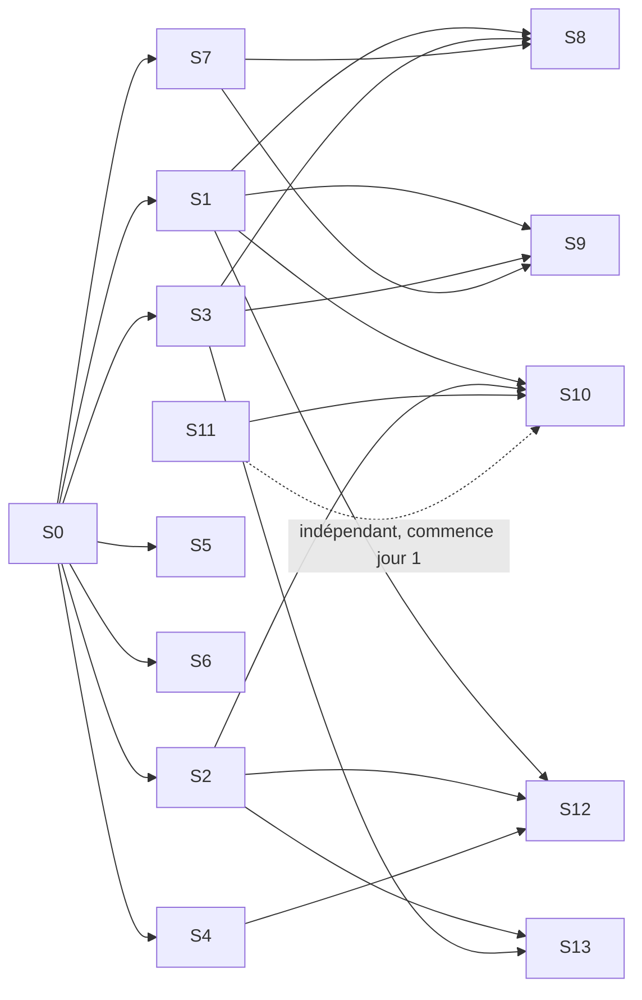

# 7. Plan de livraison, parallélisation, conventions

## 7.1 Principe : contrats d'abord, puis flux indépendants

La semaine 1 (S0) produit `packages/contracts` (schémas, OpenAPI, types générés) et les `Fake*` adaptateurs. À partir de là, **treize flux** avancent en parallèle ; chacun ne dépend des autres que via les contrats et se teste contre les fakes. L'intégration se fait en continu par la merge queue et par les jalons M1–M5 où un scénario bout en bout doit passer sur kind.

## 7.2 Flux (streams)

| Flux | Périmètre | Livrable de sortie | Dépend de | Sections |
| :-- | :-- | :-- | :-- | :-- |
| **S0 Contrats & socle** | `packages/contracts`, `packages/core` (DSL parse/validate, policy engine, résolution de modèles), fakes, CI du monorepo, `dev/` (kind + Tilt), `AGENTS.md` | Types générés Python/TS ; `choregos workflow validate` ; `make dev-up` vert | — | 1, 6.9 |
| **S1 Orchestrateur** | `apps/orchestrator` : `WorkflowInterpreter`, activités, attente humaine, gates, migration, `ProjectProvisioning` squelette, tests avec `WorkflowEnvironment` Temporal | Ticket simulé traverse `default-simple` avec fakes | S0 | 2.1 |
| **S2 Runner & agents** | `packages/runner` (client ACP, guardrails, DoD loop, résultat), `packages/tools-mcp`, image runner, backends (OpenHands d'abord), `Executor` Tekton + Job K8s, `Task` Tekton, suite de conformité backends | Un `PipelineRun` exécute un stage OpenHands sur un dépôt jouet et poste un `StageResult` valide | S0 | 2.2–2.4 |
| **S3 Connecteurs GitHub** | Tracker GitHub Issues + Projects v2, SCM GitHub App, webhooks, commentaire de statut, champs de board, merge queue, check-runs `scope`/`evidence` | Une carte déplacée → `InboundEvent` ; commentaire de coût réécrit ; PR ouverte/mergée par l'App | S0 | 3.1 |
| **S4 Gateway & coûts** | Déploiement LiteLLM (chart, config), `GatewayAdapter` (mint/spend/revoke), `cost_ledger`, agrégats, estimation, `GET /costs`, matrice de compatibilité Claude Code (headers) | Coût exact par run visible en base et via API | S0 | 4.1–4.3 |
| **S5 Front** | `apps/web` : toutes les pages contre l'API mock (Prism) puis réelle ; éditeur de workflow ; SSE | Wizard → board → run → trains → findings → mémoire utilisables | S0 (OpenAPI) | 3.4 |
| **S6 API** | `apps/api` : REST, auth OIDC, RLS, webhooks (normalisation → Temporal), internal, SSE, audit | Postman/Schemathesis 100 % OpenAPI ; webhooks GitHub/Tekton/Argo signés | S0 | 1.8, 3.5 |
| **S7 Plateforme K8s** | `charts/choregos`, `choregos-infra` (bootstrap, platform, projects ApplicationSet, policies Kyverno), environnements dev/staging/prod, sauvegardes, observabilité, egress proxy | `argocd app sync` déploie la plateforme complète en staging depuis Git | S0 | 6 |
| **S8 Templates & provisioning** | `templates/github-tekton-argo-k8s` (manifest, Tekton CI, Argo apps, scaffold), activités de `ProjectProvisioning`, tests de template | Un projet créé depuis le wizard obtient sa PR de scaffolding et ses namespaces via Argo | S1, S3, S7 | 3.2–3.3 |
| **S9 Release train & GitOps** | `ReleaseTrain`, `CdAdapter` Argo, layout GitOps, Rollouts + `AnalysisTemplate`, smoke Jobs, Atlantis, page Trains (avec S5) | Deux merges → un batch ; canary cassé → rollback + freeze | S1, S3, S7 | 5.1–5.3 |
| **S10 Findings & mémoire (côté Choregos)** | `FindingsTriage`, `MemoryAdapter` Ecphoria + pgvector, `MemoryIngestion`, `build_context_pack`, MCP mémoire, page Findings/Mémoire (avec S5) | Finding dédupliqué → ticket lié ; context pack injecté et tracé | S1, S2, S11 (E-05/E-06) | 4.4, 5.4 |
| **S11 Ecphoria** | Dans `VargaFoundation/ecphoria` : E-01 → E-14 | Image `ecphoria:memory` avec `context-pack`, upsert, pending, chart durci | — (commence jour 1) | 4.4 |
| **S12 Évals & conformité** | `EvalMatrix`, évals de playbooks, suite de conformité templates, e2e nightly, dépôts jouets | Matrice backend × modèle publiée ; e2e vert chaque nuit | S1, S2, S4 | 2.5, 4.2 |
| **S13 Multi-backend & second écosystème** | Backends Claude Code / Codex / Gemini / Goose / OpenCode (launch specs + conformité), review croisée, adaptateurs Jira/GitLab, template `azure-devops-aca` ou `gitlab-ci-argo-k8s`, `Executor` ACA | Review par un agent ≠ implémenteur ; un projet Jira/GitLab suit le même workflow | S2, S3 | 2.2, 3.1 |

Graphe de dépendances :



## 7.3 Jalons d'intégration

| Jalon | Semaine | Scénario qui doit passer sur kind (`tests/e2e`) |
| :-- | :-- | :-- |
| **M0 Contrats gelés** | 1 | Types générés, fakes, `make dev-up` ; toutes les sessions peuvent démarrer |
| **M1 Tranche verticale** | 3 | Issue GitHub labellisée `agent-ready` → `WorkflowInterpreter` (`default-simple`) → `PipelineRun` OpenHands → PR verte → commentaire de coût par étape dans l'issue → finding provoqué → issue liée |
| **M2 DSL + front** | 6 | Les trois templates de workflow ; validation humaine par déplacement de carte ; wizard crée un projet (fakes CD) ; board et runs en direct ; estimation de coût |
| **M3 Prod maîtrisée** | 9 | Provisioning réel (Argo) ; deux tickets mergés partent dans le même batch ; canary cassé → rollback → freeze ; la plateforme elle-même est déployée en staging par Argo |
| **M4 Multi-backend & mémoire** | 12 | Review croisée Claude Code ↔ OpenHands ; context pack Ecphoria dans les stages ; A/B mémoire lancé ; matrice d'évals publiée ; changement de modèle par projet sans redéploiement |
| **M5 Durci** | 16 | gVisor, egress proxy, rotation, chaos (kill worker / PipelineRun → reprise sans perte ni double coût), sauvegarde/restauration testée, second écosystème (Jira ou GitLab), docs, runbooks |

## 7.4 Sprints (2 semaines) et affectation des sessions

Hypothèse : 1 humain intégrateur + N sessions Claude Code en parallèle (une par flux actif). Une session = un worktree = une branche `stream/<Sx>/<story>`. Le tableau donne l'ordre de priorité des stories (voir `08-backlog.yaml`, champ `sprint`).

| Sprint | Flux actifs | Objectif |
| :-- | :-- | :-- |
| 0 (sem. 1) | S0, S11 (E-01) | M0 ; triage des PR Ecphoria |
| 1 (sem. 2–3) | S1, S2, S3, S4, S6, S7 (dev+staging), S11 (E-02, E-06, E-08) | M1 |
| 2 (sem. 4–6) | S1 (DSL complet), S5, S6, S8, S12 (conformité), S11 (E-03, E-04, E-05) | M2 |
| 3 (sem. 7–9) | S7 (prod), S8, S9, S5 (trains), S10 (findings), S11 (E-07, E-10, E-11) | M3 |
| 4 (sem. 10–12) | S10 (mémoire), S12 (évals), S13 (backends), S4 (matrice), S11 (E-09, E-12) | M4 |
| 5 (sem. 13–16) | S7 (durcissement), S13 (Jira/GitLab, ACA), S12 (chaos), S11 (E-13, E-14), docs | M5 |

## 7.5 Mode opératoire Claude Code (ou tout agent ACP)

1. **Une session par flux**, dans un worktree dédié : `git worktree add ../choregos-S3 -b stream/S3 && cd ../choregos-S3 && claude`. Prompt d'ouverture : « Lis `docs/plan/00-index.md`, `docs/plan/01-architecture-et-contrats.md` et la section de ton flux (colonne *Sections* du tableau 7.2). Prends les stories `stream: S3` de `docs/plan/08-backlog.yaml` dans l'ordre `sprint`, `priority`. Pour chaque story : plan (mode plan), implémentation, tests, PR séparée titrée `[S3-04] …`, coche l'`acceptance` dans la description. Ne modifie pas `packages/contracts` : si un contrat manque, ouvre une issue `contract-change` et continue avec un contournement local marqué `TODO(contract)`. »
2. **Session intégratrice** (humain + Claude) : revoit les PR, fait tourner `make ci`, fusionne par merge queue, met à jour `docs/plan/STATUS.md` (tableau stories → état), tranche les `contract-change`, lance les e2e de jalon.
3. **Conventions de PR** : une story = une PR ; description = template (section 7.7) ; le corps cite les critères d'acceptation cochés ; CI verte obligatoire ; pas de force-push sur `main`.
4. **Quand une session bloque** : elle écrit `docs/plan/BLOCKERS.md` (flux, story, cause, contournement proposé) et passe à la story suivante non dépendante.
5. **Sous-agents** : autorisés pour l'exploration et les revues ; l'écriture reste dans le worktree du flux.
6. **Dogfooding** : dès M1, le monorepo `choregos` est le premier projet Choregos (`template github-tekton-argo-k8s`, workflow `default-simple`) ; les stories des sprints 3+ passent par la plateforme.

## 7.6 `AGENTS.md` du monorepo (copier à la racine ; `CLAUDE.md` → lien symbolique)

```markdown
# Choregos — instructions pour les agents

## Contexte
Plateforme de delivery agentique (Varga Foundation, Apache 2.0). Plan complet : `docs/plan/`. Contrats : `packages/contracts` (ne pas modifier sans PR `contract-change`).

## Commandes
- Tout : `make ci` (lint + typecheck + tests unitaires) · `make dev-up` / `make dev-down` (kind + Tilt) · `make e2e`
- Python (uv) : `uv run ruff check . && uv run ruff format --check . && uv run mypy packages apps && uv run pytest -q`
- Web : `pnpm -C apps/web lint && pnpm -C apps/web typecheck && pnpm -C apps/web test && pnpm -C apps/web build`
- Charts : `helm lint charts/choregos && helm template charts/choregos | kubeconform -strict`
- Contrats : `make contracts` (régénère les types ; committer le résultat)

## Conventions
- Python 3.12, typage strict (`mypy --strict` sur `packages/*`), pydantic v2, async partout côté I/O, structlog. TypeScript strict, ESLint, Prettier.
- Commits conventionnels : `feat(orchestrator): …`, `fix(runner): …`, `contract(schemas): …`. Une story = une PR = un squash.
- Tests : unitaires obligatoires ; intégration avec fakes (`CHOREGOS_FAKES=1`) ; e2e sur kind pour les jalons. Couverture ≥ 80 % sur `packages/core`, `packages/runner`, `apps/orchestrator`.
- Idempotence : toute activité Temporal et tout step de provisioning est rejouable sans effet double.
- Sécurité : aucun secret en dur ; jamais de token large dans un runner ; toute écriture tracker via l'API interne.
- Journaux : JSON, clés `project`, `work_item`, `run_id`, `stage` quand disponibles.

## Definition of done (bloquante)
Tests verts (`make ci`), typage vert, lint vert, docs mises à jour (`docs/` ou docstrings), critères d'acceptation de la story cochés dans la PR, pas de `TODO` sans issue liée, `docs/plan/STATUS.md` mis à jour par l'intégrateur.

## Hors périmètre
Si tu découvres un problème hors de ta story : n'y touche pas, ouvre une issue `finding` avec `origin: <story>`, preuve et proposition. Si tu as besoin d'un contrat : issue `contract-change`.

## Mémoire
Les décisions d'architecture sont dans `docs/plan/` et `docs/adr/`. Lis-les avant de décider ; ajoute un ADR (`docs/adr/NNNN-*.md`) pour toute décision structurante.
```

## 7.7 Template de PR (`.github/PULL_REQUEST_TEMPLATE.md`)

```markdown
## Story
`[Sx-NN] titre` — lien `docs/plan/08-backlog.yaml`
## Changement
…
## Critères d'acceptation
- [ ] …
## Preuves
Commandes exécutées, résultats de tests, captures si front
## Contrats
- [ ] Aucun changement dans `packages/contracts` (sinon PR `contract-change` liée : #…)
## Findings déposés
- #…
```

## 7.8 CI du monorepo (`.github/workflows`, puis Tekton dès M3)

`ci.yml` (PR) : détection des chemins modifiés → jobs ciblés : `python` (ruff, mypy, pytest par package), `web` (lint, typecheck, vitest, build), `charts` (lint, kubeconform, unittest Helm), `contracts` (validation des schémas, génération, diff vide), `images` (build multi-arch, Trivy, cosign sign sur `main`), `conformance-backends` (kind éphémère, OpenHands seulement en PR ; tous les backends la nuit), `templates` (provisioning sur kind, nightly). `release.yml` : tag semver → images, charts OCI, changelog (release-please). `nightly.yml` : e2e complet, `EvalMatrix`, replay Temporal, scan de dépendances.

## 7.9 Risques

| Risque | Parade |
| :-- | :-- |
| Dérive des contrats entre flux | Gel à M0, PR `contract-change` uniques, types générés, tests de contrat (Schemathesis, Pact-like sur `StageInput/Result`) |
| ACP jeune ; adaptateurs inégaux | Suite de conformité par backend en CI ; OpenHands natif en repli ; backends désactivés automatiquement |
| Un agent contourne les permissions | Garantie = vérification de diff + gate + sandbox, pas la permission |
| Coûts de tokens | Clé par run avec plafond dur ; budget ticket ; alertes 80 % ; `cheap` pour triage/dédup ; cache activé |
| Ecphoria immature | Périmètre mémoire seul ; repli pgvector même interface ; A/B avant dépendance |
| Temporal mal versionné | `patched()` obligatoire ; replay en CI ; `numHistoryShards` figé |
| Tekton : gouvernance mouvante | `Executor` Job K8s prêt ; Task simple, peu de features avancées |
| Conflits entre sessions parallèles | Worktrees, périmètres disjoints par flux, merge queue, fakes |
| Sur-ingénierie | Chaque sprint livre un scénario e2e utilisable ; rien de « phase 6 » avant M3 |

## 7.10 Checklist jour 0 (humain)

1. Créer `VargaFoundation/choregos` et `VargaFoundation/choregos-infra` (Apache 2.0), activer merge queue, branch protection, Dependabot/Renovate.
2. Réserver le nom (section 0.2) : domaines, org packages, PyPI/npm.
3. Comptes fournisseurs : Anthropic Console (workspace `choregos`, clés, plafond), OpenAI/Google/Foundry selon choix ; clé LiteLLM `master_key`.
4. Cluster : AKS ou GKE (1.31+), pools `system`/`platform`/`runners` (spot), gVisor sur `runners`, DNS `*.choregos.<domain>`, bucket versionné, Key Vault / Secret Manager.
5. App GitHub `choregos-bot` (permissions section 3.1) et App `choregos-infra-writer` (Contents RW sur `choregos-infra`).
6. IdP OIDC (Entra ID / Google / Keycloak) : client `choregos`, groupes `product-owners`, `release-captains`, `developers`.
7. Slack : app, canal `#choregos`.
8. Copier `docs/plan/`, `AGENTS.md`, lancer S0.
